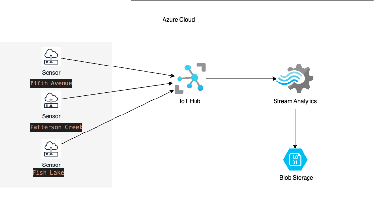

Azure IoT Hub with Stream Analytics to Process Streaming Da# Azure IoT Hub with Stream Analytics to Process Streaming Data

## 📖 Overview
This project demonstrates how to simulate IoT sensor telemetry and use **Azure Stream Analytics** to process and store the results into **Azure Blob Storage**. The telemetry includes temperature, humidity, ice thickness, and snow depth, sent from multiple locations along the Rideau Canal.

---

## 📊 System Architecture


- **Input**: Simulated IoT data (Python script)
- **Azure IoT Hub**: Ingests real-time messages
- **Azure Stream Analytics**: Aggregates data using time-based windows
- **Azure Blob Storage**: Stores processed results in JSON format

---

## 💪 Setup & Execution Steps

### ✅ Step 1: Set Up Azure IoT Hub

#### 1. Create IoT Hub
- In Azure Portal, search for **IoT Hub** and click **Create**.
- Provide name, region, and use **Free Tier**.

#### 2. Register Device
- Go to **IoT Hub > Devices** → Add `sensor-device-1`
- Save and copy the **connection string**

---

### ✅ Step 2: Write & Run Python Simulator

#### Python Requirements
```bash
pip install azure-iot-device
```

#### main.py
```python
import time
import random
import json
from datetime import datetime, timezone
from azure.iot.device import IoTHubDeviceClient, Message

CONNECTION_STRING = "<replace-with-your-connection-string>"

def get_telemetry():
    current_time_utc = datetime.now(timezone.utc).isoformat()
    return {
        "location": random.choice(["Fish Lake", "Fifth Avenue", "Patterson Creek"]),
        "temperature": round(random.uniform(-15.0, 0.0), 2),
        "humidity": round(random.uniform(60.0, 90.0), 2),
        "ice_thickness_cm": round(random.uniform(10.0, 30.0), 2),
        "snow_depth_cm": round(random.uniform(0.0, 20.0), 2),
        "event_time": current_time_utc
    }

def main():
    client = IoTHubDeviceClient.create_from_connection_string(CONNECTION_STRING)
    print("Sending telemetry to IoT Hub...")
    try:
        while True:
            telemetry = get_telemetry()
            message = Message(json.dumps(telemetry))
            client.send_message(message)
            print(f"Sent message: {telemetry}")
            time.sleep(10)
    except KeyboardInterrupt:
        print("Stopped sending messages.")
    finally:
        client.disconnect()

if __name__ == "__main__":
    main()
```

---

### ✅ Step 3: Configure Azure Stream Analytics

#### 1. Add Input
- Input: `8916RideauCanalHub`

#### 2. Add Output
- Output alias: `sensor-output` (Blob Storage container)

#### 3. Query to Process Data (5-minute aggregation)
```sql
SELECT
  location,
  AVG(ice_thickness_cm) AS avg_ice_thickness,
  MAX(snow_depth_cm) AS max_snow_depth,
  System.Timestamp AS window_end_time
INTO
  [sensor-output]
FROM
  [8916RideauCanalHub]
TIMESTAMP BY event_time
GROUP BY
  TUMBLINGWINDOW(minute, 5), location
```

#### 4. Start Job
- Ensure **IoT Hub messages are flowing**
- Start the **Stream Analytics Job**

---

## 📂 Output Format

- Stored as JSON in Azure Blob:
```json
{
  "location": "Fish Lake",
  "avg_ice_thickness": 21.3,
  "max_snow_depth": 12.4,
  "window_end_time": "2025-04-10T18:05:00.0000000Z"
}
```

---

## 📸 Screenshot Reference

Screenshots of each step are stored in `/screenshots/` folder:
- Blob Storage: container creation
- IoT Hub setup: registration, connection string
- Stream Analytics: inputs, outputs, job configuration, success

---

## 🚀 Status Checklist

- [x] Simulated IoT data generator using Python
- [x] Azure IoT Hub receives real-time telemetry
- [x] Stream Analytics aggregates data every 5 mins
- [x] Aggregated data exported to Blob in JSON format

---

## 👤 Author Info

**Shaoxian Duan**  
Course: CST8916 Real-Time Applications  
Final Project – IoT Stream Analytics

